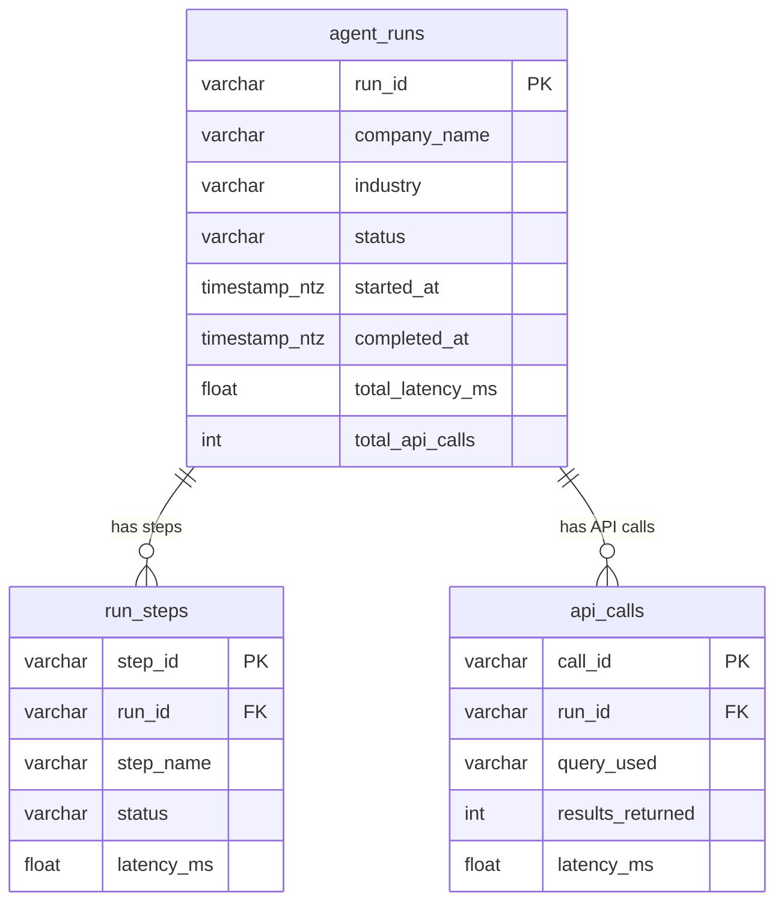

# Tavily Data Pipeline

A data pipeline that runs a Tavily-based company research agent, collects execution metadata, and streams it through **MongoDB → AWS Kinesis Firehose → S3 → Snowflake Snowpipe**, with a Streamlit dashboard for visualization and analytics.

### Task requirements (mapping)

| Requirement | How it is met |
|-------------|----------------|
| Stream data to S3 using Kinesis Firehose | Firehose client streams metadata to a delivery stream → S3; alternative (e.g. direct S3 or skip) documented. |
| Data architecture / ERD | Three tables (`agent_runs`, `run_steps`, `api_calls`) and full ERD in [docs/data_model_erd.md](docs/data_model_erd.md); Mermaid ERD in this README. |
| Snowpipe to ingest into Snowflake | `scripts/snowpipe_setup.sql`: tables, stage, and Snowpipes for auto-ingest from S3. |
| Secure repo: .env or secrets manager | `.env` for local dev; `.env` in `.gitignore`; `.env.example` has placeholders only; [Secrets](#how-secrets-are-handled-securely) section in README. |
| No credentials in GitHub | All secrets via env vars; `.env` never committed. |
| README: architecture, setup/deploy, secrets | This README: architecture overview, [Setup and deployment](#setup-and-deployment-instructions), [How secrets are handled](#how-secrets-are-handled-securely). |

---

## Overview of Pipeline Architecture

Data flows from the agent through storage and into analytics as follows:

```
┌─────────────────┐     ┌─────────────┐     ┌──────────────┐     ┌───────────┐     ┌───────────┐
│  Toy AI Agent   │────▶│  Metadata   │────▶│   MongoDB    │────▶│ Firehose  │────▶│     S3    │
│  (Tavily)       │     │  Collector  │     │   Atlas      │     │           │     │            │
└─────────────────┘     └─────────────┘     └──────────────┘     └───────────┘     └─────┬─────┘
                                                                                         │
                                                                                         ▼
┌─────────────────┐     ┌─────────────┐
│   Streamlit     │◀────│  Snowflake  │◀──── Snowpipe (auto-ingest from S3)
│   Dashboard     │     │  (3 tables) │
└─────────────────┘     └─────────────┘
```

1. **Toy AI Agent** — Runs company research using the Tavily API (and optionally OpenAI for summarization).
2. **Metadata Collector** — Captures run-level, step-level, and API-call-level metrics.
3. **MongoDB** — Stores metadata documents; optional but useful for debugging and as a source for Firehose.
4. **AWS Kinesis Firehose** — Streams metadata to S3 (buffer: size/time-based). 
5. **Snowpipe** — Automatically ingests new JSON files from S3 into Snowflake tables.
6. **Streamlit Dashboard** — Reads from Snowflake (or falls back to MongoDB) to visualize Agent Health, Performance, Usage, and Cost Efficiency.

Detailed data flow and component interactions are in [docs/architecture.md](docs/architecture.md).

---

## Data Architecture and ERD

The pipeline is built around **three normalized tables** in Snowflake so we can answer business questions clearly:

| Table        | Purpose |
|-------------|---------|
| **agent_runs** | One row per research run: company, industry, status, total latency, total API calls. |
| **run_steps**  | One row per step in a run (e.g. search_overview, search_competitors, summarize): status and latency. |
| **api_calls**  | One row per Tavily (or other) API call: query, results count, latency. |

**agent_runs** is the parent; **run_steps** and **api_calls** link via `run_id`. This supports run-level KPIs, step-level debugging, and call-level cost/usage analysis.

**ERD visualization:**


A full **Entity Relationship Diagram (ERD)** and column descriptions are in **[docs/data_model_erd.md](docs/data_model_erd.md)**. Mermaid version:



---

## Why This Shape? Business Questions We Answer

The pipeline and 3-table design are built to support four areas of analysis:

1. **Agent Health** — Success vs failure rates, error breakdown, which companies or steps fail most.
2. **Agent Performance** — Latency trends, slowest steps, bottlenecks (using `run_steps` and `agent_runs.total_latency_ms`).
3. **Usage & Demand** — Runs over time, top companies researched, peak hours (from `agent_runs` and optional filters).
4. **Cost Efficiency** — API calls per run, expensive or duplicate queries (from `api_calls` and `agent_runs.total_api_calls`).

The dashboard sections map to these; the tables are structured so each question can be answered with simple aggregations and joins.

---

## Toy Agent: What Changed (Design and Purpose)

The toy agent is designed to be **predictable and observable**: explicit steps, clear schema, and metrics at run, step, and API-call level.

### What changed

- **Research is 3 explicit steps** (instead of one generic search):
  - **search_overview** — Tavily: `"{company} company overview"`
  - **search_competitors** — Tavily: `"{company} competitors market"`
  - **summarize** — OpenAI (if configured): from the combined sources, extract `company_name` (normalized) and `industry` (single label, e.g. SaaS, Fintech) as JSON. If OpenAI is missing or fails, we use `company_name = raw query`, `industry = null`, and mark the step as skipped.

- **Structured data for the pipeline** — Each run produces three logical “tables” for persistence and analytics:
  - **agent_runs** — One row per run: `run_id`, `company_name`, `industry`, `status`, `started_at`, `completed_at`, `total_latency_ms`, `total_api_calls`, `error_message`.
  - **run_steps** — One row per step: `step_id`, `run_id`, `step_name`, `status`, `latency_ms`, `error_message`.
  - **api_calls** — One row per Tavily call: `call_id`, `run_id`, `query_used`, `results_returned`, `latency_ms`, `called_at`.

- **MetadataCollector** was extended with per-step and per-API-call tracking so it can build an envelope (agent_run + run_steps + api_calls) for MongoDB/Firehose and for loading into the three Snowflake tables.

### Purpose

- Make the agent a **small, well-defined pipeline** with clear steps and a single outcome schema.
- Produce data that **matches the target model** (agent_runs, run_steps, api_calls) for loading into Snowflake and building dashboards.
- Support **observability**: run-level outcomes (company, industry, status, latency), step-level detail (which step failed, latency per step), and call-level detail (queries, result counts, latency).

*Note: The current codebase includes a simplified single-search agent and a flat metadata collector; the dashboard and Snowflake client are built for the 3-table model. The full 3-step agent and envelope-shaped metadata can be implemented on top of the same run script and pipeline.*

---

## Setup and Deployment Instructions

### Prerequisites

- Python 3.9+
- (Optional) MongoDB Atlas account
- (Optional) AWS account (for Firehose and S3)
- (Optional) Snowflake account

### 1. Clone and enter the project

```bash
cd tavily_data_pipline
```

### 2. Virtual environment and dependencies

```bash
python3 -m venv venv
source venv/bin/activate   # Windows: venv\Scripts\activate
pip install -r requirements.txt
```

### 3. Environment and secrets (required for agent)

Copy the example env file and fill in at least the Tavily key:

```bash
cp .env.example .env
# Edit .env: set TAVILY_API_KEY (required). Others are optional.
```

Never commit `.env`; it is listed in `.gitignore`. See [How secrets are handled](#how-secrets-are-handled-securely) below.

### 4. Run the agent

```bash
python3 scripts/run_agent.py "OpenAI"
# Or: python3 scripts/run_agent.py "Tesla" --max-sources 5
# Skip Firehose: python3 scripts/run_agent.py "Nvidia" --no-firehose
```

The script will run research, collect metadata, optionally save to MongoDB, and optionally stream to Firehose.

### 5. Run the dashboard

```bash
streamlit run src/dashboard/app.py
```

Open http://localhost:8501. The dashboard tries Snowflake first, then falls back to MongoDB.

### 6. Optional: MongoDB Atlas

1. Create an account at [mongodb.com/atlas](https://www.mongodb.com/atlas), create a free M0 cluster.
2. Create a database user and allow network access.
3. Get the connection string (Connect → Drivers).
4. Set `MONGODB_URI` in `.env`.

### 7. Optional: AWS Firehose and S3

1. In AWS, create a Kinesis Firehose delivery stream with an S3 destination.
2. Set in `.env`: `FIREHOSE_STREAM_NAME`, `S3_BUCKET_NAME`, `AWS_REGION`, and AWS credentials (see Environment Variables).
3. If you have payment or setup constraints, you can omit Firehose and use only MongoDB (and optionally manual export to S3).

### 8. Optional: Snowflake and Snowpipe

1. Create a Snowflake account, database, and schema.
2. Run the DDL and Snowpipe setup: edit placeholders in `scripts/snowpipe_setup.sql` (bucket, prefix, IAM role), then execute the script in Snowflake.
3. Configure S3 event notifications so that when new files arrive, Snowpipe is triggered (see comments in `snowpipe_setup.sql`).
4. Set Snowflake credentials in `.env` (see Environment Variables).

---

## How Secrets Are Handled Securely

- **No credentials in the repo** — All secrets (API keys, DB URIs, AWS keys, Snowflake password) are read from environment variables. The project uses a **`.env` file** (loaded via `python-dotenv`) for local development; `.env` is in **`.gitignore`** and is never committed.
- **`.env.example`** — Contains only placeholder names (e.g. `your-tavily-api-key`). Copy to `.env` and fill in real values locally; do not commit `.env`.
- **Production** — Prefer a **secrets manager** (e.g. AWS Secrets Manager, HashiCorp Vault) or CI/CD secrets; inject env vars at runtime and avoid storing secrets in code or in the repo.
- **Rotation** — Rotate API keys and DB credentials periodically. In production, use IAM roles for AWS instead of long-lived access keys where possible.

---

## Environment Variables

| Variable | Required | Description |
|----------|----------|-------------|
| TAVILY_API_KEY | Yes | Tavily API key for the agent |
| OPENAI_API_KEY | Optional | For summarize step (normalized company_name, industry) |
| MONGODB_URI | For MongoDB | MongoDB connection string |
| FIREHOSE_STREAM_NAME | For Firehose | Kinesis Firehose delivery stream name |
| S3_BUCKET_NAME | For Firehose | S3 bucket for Firehose delivery |
| AWS_ACCESS_KEY_ID | For Firehose | AWS access key |
| AWS_SECRET_ACCESS_KEY | For Firehose | AWS secret key |
| AWS_REGION | For Firehose | AWS region (e.g. us-east-1) |
| SNOWFLAKE_ACCOUNT | For Snowflake | Snowflake account identifier |
| SNOWFLAKE_USER | For Snowflake | Snowflake username |
| SNOWFLAKE_PASSWORD | For Snowflake | Snowflake password |
| SNOWFLAKE_WAREHOUSE | For Snowflake | Warehouse name |
| SNOWFLAKE_DATABASE | For Snowflake | Database name |
| SNOWFLAKE_SCHEMA | For Snowflake | Schema name |

---

## Project Structure

```
tavily_data_pipline/
├── src/
│   ├── agent/           # Toy agent and metadata collector
│   ├── database/        # MongoDB client
│   ├── pipeline/        # Firehose client and metadata streamer
│   ├── snowflake/       # Snowflake client (agent_runs, run_steps, api_calls)
│   └── dashboard/       # Streamlit app
├── scripts/
│   ├── run_agent.py     # Main agent + pipeline script
│   └── snowpipe_setup.sql  # Snowflake DDL and Snowpipe definitions
├── config/              # config.yaml
├── docs/
│   ├── architecture.md # Data flow and components
│   └── data_model_erd.md # Table architecture and ERD
├── .env.example         # Template for secrets (no real values)
└── README.md
```

---

## What Might Be Missing or Optional

- **Firehose alternative** — If you cannot use Kinesis Firehose (e.g. billing or region limits), you can write metadata to S3 from your app or a small Lambda, or rely on MongoDB and periodic export. The rest of the pipeline (Snowpipe, dashboard) still applies once data lands in S3 or Snowflake.
- **3-step agent implementation** — The README describes the *target* design (search_overview, search_competitors, summarize and the envelope with agent_runs/run_steps/api_calls). The repo may ship a simplified single-search agent; the Snowflake schema and dashboard are ready for the full 3-table payload when you add it.
- **Snowpipe S3 paths** — `scripts/snowpipe_setup.sql` assumes separate prefixes (e.g. `runs/`, `steps/`, `calls/`) for each table. If your writer emits one envelope per run, you can use a single raw table and a task or view to split into the three tables, or adapt the writer to emit one object type per prefix.
- **Idempotency** — For production, consider idempotent keys (e.g. `run_id`) and Snowpipe merge/upsert logic so duplicate S3 deliveries do not create duplicate rows.

---

## Documentation

- [docs/architecture.md](docs/architecture.md) — Data flow, components, error handling.
- [docs/data_model_erd.md](docs/data_model_erd.md) — Table architecture and ERD for agent_runs, run_steps, api_calls.
