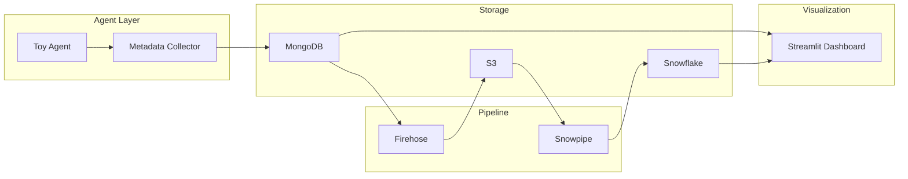
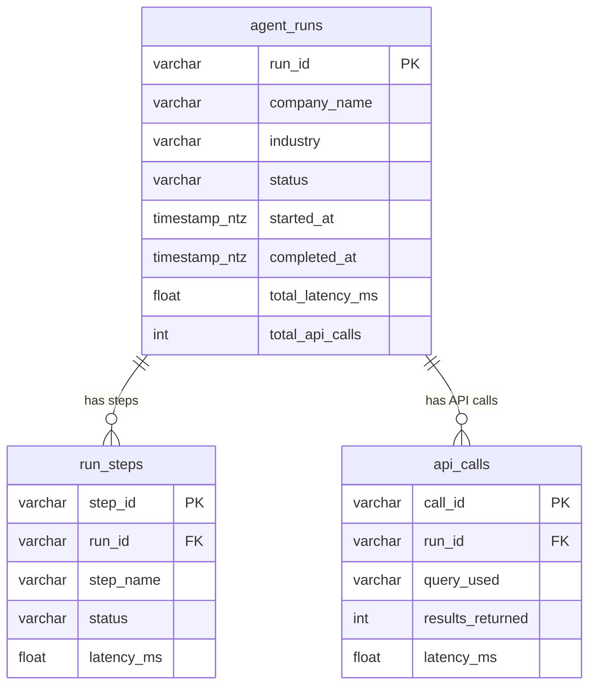

# Tavily Data Pipeline

A pipeline that runs a company-research agent (Tavily), collects execution metadata, and streams it to storage and analytics so we can answer clear **business questions** and present them in a dashboard.

**Purpose** — We want to know how the agent behaves in the wild: is it healthy, fast, used as expected, and cost-effective? The pipeline exists to turn raw runs into structured, queryable data (agent health, performance, usage, cost) and to support future questions—e.g. per-user behavior and cost attribution (see [Data architecture](#data-architecture-and-erd)).

---

## Overview of pipeline

Data flows as follows. Each component is described in one sentence below the diagram.



- **Toy Agent** — Runs company research via the Tavily API (and optionally OpenAI for summarization).
- **Metadata Collector** — Captures run-, step-, and API-call-level metrics for persistence.
- **MongoDB** — Stores metadata documents and can serve as a source for the dashboard and for Firehose.
- **Firehose** — Streams metadata to S3 (buffer size/time configured in AWS).
- **S3** — Landing zone for Firehose; Snowpipe reads from here.
- **Snowpipe** — Automatically ingests new files from S3 into Snowflake tables.
- **Snowflake** — Holds the normalized tables the dashboard queries.
- **Streamlit Dashboard** — Reads from Snowflake (or falls back to MongoDB) and visualizes agent health, performance, usage, and cost.

More detail: [docs/architecture.md](docs/architecture.md).

---

## Data architecture and ERD

The pipeline is built around **three normalized tables** so we can answer the business questions above and support drill-down.

**ERD:**


Same model in Mermaid:



**Purpose of each table**

| Table | Purpose |
|-------|---------|
| **agent_runs** | One row per run: company, industry, status, timings, total API calls. Used for run-level KPIs and dashboards. |
| **run_steps** | One row per step in a run (e.g. search_overview, search_competitors, summarize). Used to see which step failed or is slow. |
| **api_calls** | One row per external API call (e.g. Tavily). Used for cost and duplicate-query analysis. |

**Why this shape** — These tables directly support the four areas we care about: **Agent Health** (success/failure, errors), **Agent Performance** (latency, bottlenecks), **Usage & Demand** (runs over time, top companies), and **Cost Efficiency** (API calls per run, expensive or duplicate queries). The dashboard is built on these. In the future we may extend with more dimensions—for example **per-user** usage and **cost attribution** (e.g. by team or project)—using the same run/step/call backbone.

Full ERD and column list: [docs/data_model_erd.md](docs/data_model_erd.md).

---

## Design decisions

**Toy agent** — Research is split into **three explicit steps** instead of one generic search: (1) **search_overview** (Tavily: company overview), (2) **search_competitors** (Tavily: competitors/market), (3) **summarize** (OpenAI, if configured): from combined sources, extract normalized `company_name` and a single `industry` label (e.g. SaaS, Fintech). If OpenAI is missing or fails, we fall back to `company_name = raw query`, `industry = null`, and mark the step as skipped. This keeps the agent predictable and observable and produces a clear schema (run + steps + API calls) for the pipeline and dashboard.

**Structured output** — Each run is designed to map to the three tables (`agent_runs`, `run_steps`, `api_calls`) so we can load once and answer health, performance, usage, and cost questions without ad-hoc parsing.

---

## Monitoring and logging

*(You can expand here with how you run this in production—e.g. which platforms and how you centralize logs.)*

In this repo, observability is implemented as follows. The **Metadata Collector** records run-level metrics (status, latency, API call count) and can be extended to record per-step and per-API-call detail. **run_agent.py** prints a short summary (research result, MongoDB id, Firehose sent/failed) and relies on these metadata structures for downstream storage (MongoDB, Firehose → S3) and analytics (Snowflake, dashboard). There is no centralized log aggregation in the codebase; logs are local stdout. For production you would typically ship these logs and metrics to your preferred monitoring and logging platform.

---

## Secrets and configuration

All secrets (API keys, DB URIs, AWS and Snowflake credentials) are read from **environment variables**. Locally we use a **`.env`** file (via `python-dotenv`); `.env` is in `.gitignore` and is never committed. `.env.example` lists variable names with placeholders only. In production, credentials will be managed in a **secrets manager / vault** (e.g. HashiCorp Vault or cloud provider secrets) and injected as env vars at runtime.

---

## Repository structure

The project is split into small, focused modules so responsibilities stay clear and the pipeline is easy to extend or test.

| Area | Role |
|------|------|
| **src/agent** | Toy agent and metadata collector (research logic and metrics). |
| **src/database** | MongoDB client (persist and query metadata). |
| **src/pipeline** | Firehose client and metadata streamer (MongoDB → Firehose). |
| **src/snowflake** | Snowflake client and queries for the three tables. |
| **src/dashboard** | Streamlit app (health, performance, usage, cost). |
| **scripts/** | Entrypoints: setup (venv, deps, .env), run_agent, Snowpipe DDL. |
| **config/** | Runtime config (e.g. config.yaml). |
| **docs/** | Architecture and data model (flow, ERD, columns). |

---

## Setup and how to run

**Requirements** — Python 3.9+. For the full pipeline (agent → MongoDB → Firehose → S3 → Snowflake): Tavily API key, MongoDB URI, AWS credentials and Firehose stream, Snowflake credentials and Snowpipe (see [Environment variables](#environment-variables)).

**One-time setup**

```bash
git clone <repo-url>
cd tavily_data_pipline
./scripts/setup.sh
```

*(Windows: `scripts\setup.bat`.)* This creates a venv, installs dependencies, and copies `.env.example` to `.env` if missing.

**Secrets** — Edit `.env` and set at least **TAVILY_API_KEY**. Add MongoDB, AWS, and Snowflake variables as needed for the full path.

**Run the agent**

```bash
source venv/bin/activate   # Windows: venv\Scripts\activate
python scripts/run_agent.py "Nvidia"
```

Use `--no-firehose` to skip Firehose; use `--verify-snowflake` to check that Snowflake has recent rows.

**Run the dashboard**

```bash
streamlit run src/dashboard/app.py
```

Open http://localhost:8501. The dashboard reads from Snowflake when configured, otherwise from MongoDB.

**Environment variables**

| Variable | Purpose |
|----------|---------|
| TAVILY_API_KEY | (Required) Tavily API key. |
| OPENAI_API_KEY | Optional; for summarize step. |
| MONGODB_URI | MongoDB connection string. |
| FIREHOSE_STREAM_NAME, S3_BUCKET_NAME, AWS_REGION, AWS_ACCESS_KEY_ID, AWS_SECRET_ACCESS_KEY | Firehose → S3. |
| SNOWFLAKE_ACCOUNT, SNOWFLAKE_USER, SNOWFLAKE_PASSWORD, SNOWFLAKE_WAREHOUSE, SNOWFLAKE_DATABASE, SNOWFLAKE_SCHEMA | Snowflake. |

---

## Documentation

- [docs/architecture.md](docs/architecture.md) — Data flow, components, error handling, deployment notes.
- [docs/data_model_erd.md](docs/data_model_erd.md) — Full ERD and column reference for the three tables.
