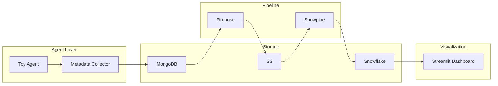
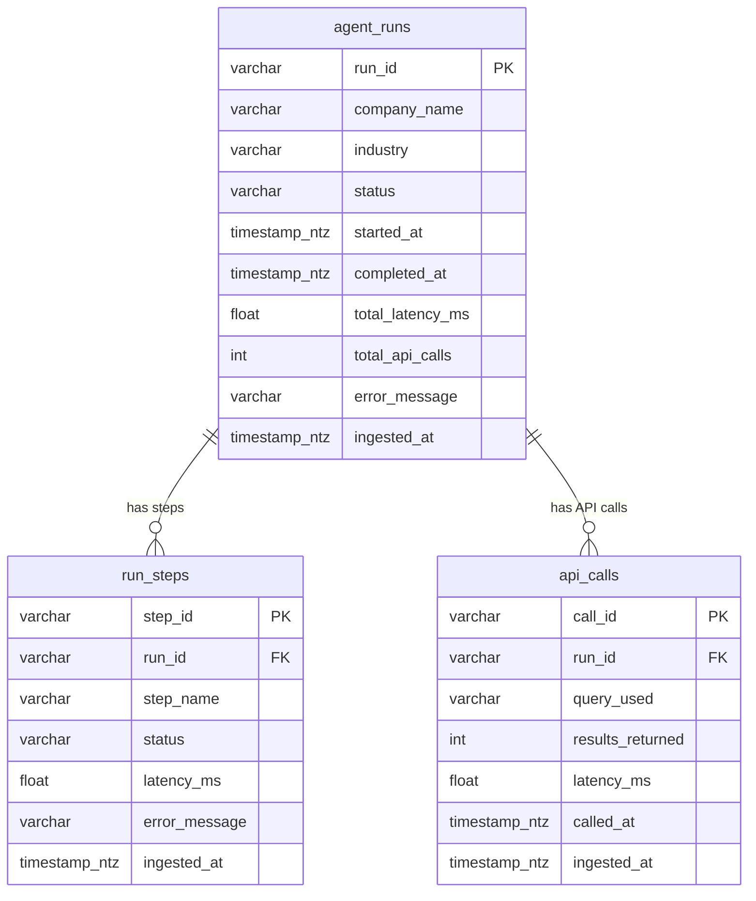

# Tavily Data Pipeline

End-to-end data pipeline: a toy AI agent researches companies via Tavily (with OpenAI summarization), the pipeline collects execution metadata, stores it in MongoDB, streams it through AWS Firehose → S3 → Snowpipe into Snowflake, and visualizes it in a Streamlit dashboard. The pipeline is designed to answer four questions about agent behavior: **health, performance, usage, and cost**.

---

## Pipeline overview



| Component | What it does |
|-----------|-------------|
| **Toy Agent** | Three-step company research: two Tavily `advanced` searches (overview + competitors) and an OpenAI summarization step that extracts a normalized company name, industry label, and brief summary. |
| **Metadata Collector** | Captures run-level metrics and per-step / per-API-call detail (latency, status, results, timestamps) for every execution. |
| **MongoDB** | Persists the full metadata document — the single source of truth. |
| **Metadata Streamer** | The transform layer: expands each metadata document into one `agent_run` + N `run_step` + M `api_call` records and sends them to Firehose. |
| **Firehose** | Delivers newline-delimited JSON to S3, prefix-routed by `record_type` for per-table ingestion. |
| **Snowpipe** | Three pipes with `AUTO_INGEST` — each reads its own S3 prefix and loads typed rows into the corresponding Snowflake table. |
| **Snowflake** | Holds the three normalized tables the dashboard queries. |
| **Dashboard** | Streamlit app organized into four business-question sections, reading from Snowflake. |

Component internals, data-flow steps, and error-handling strategies: [docs/architecture.md](docs/architecture.md).

---

## Data model

Three normalized tables, derived from a single metadata document per run.



**Why three tables?** The Metadata Streamer expands each MongoDB document into one `agent_run`, N `run_step` records, and M `api_call` records. This separates concerns: run-level KPIs live in `agent_runs`, step-level drill-down in `run_steps`, and API-level cost analysis in `api_calls`. Because the agent tracks real steps and API calls (not synthetic ones), the number of records per run naturally reflects the actual agent behavior — currently 3 steps and 2–3 API calls per run, but the schema supports any future agent topology without migration.

Full column reference, source mapping, and transformation logic: [docs/data_model_erd.md](docs/data_model_erd.md).

---

## Dashboard

The Streamlit dashboard (`src/dashboard/app.py`) reads from Snowflake and is organized into four sections, each answering a distinct business question about the agent.

| Section | Business question | Charts and metrics |
|---------|------------------|--------------------|
| **Agent Health** | Is the agent reliable? | Total runs, success/failure rate metrics · Bar chart: companies with most failures · Bar chart: steps that fail most (search_overview vs search_competitors vs summarize) · Expandable recent-error log |
| **Agent Performance** | Is the agent fast? | Histogram: run latency distribution (ms) · Donut chart: runs by industry (populated by the OpenAI summarize step) |
| **Usage & Demand** | How is the agent being used? | Area chart: runs over time (hourly) · Bar chart: top researched companies |
| **Cost Efficiency** | Is it cost-effective? | Total and average API-call metrics · Bar chart: average latency per step · Bar chart: average latency per company |

A **Raw Data** viewer at the bottom lets you inspect individual rows from any of the three tables.

**Filters:** time range (all time / date range), max-rows slider, refresh button.

---

## Design decisions

These are the choices that go beyond the default path and explain the shape of the pipeline.

**Three-step agent with graceful degradation.** Each query is split into two targeted Tavily searches (company overview + competitors/market) and an OpenAI summarization step. The two searches give broader, more diverse source coverage than a single query. The summarize step extracts a normalized `company_name` and `industry` label, which directly feed dashboard charts (e.g. "runs by industry"). If OpenAI is not configured, the summarize step is marked `skipped` — the pipeline still works, just without the enriched fields.

**Real per-step and per-API-call tracking.** The agent records each step and API call with its own timing, status, and result count. These aren't synthetic records invented by the streamer — they reflect actual execution. This means `run_steps` has real variation across step names and statuses, and `api_calls` distinguishes Tavily calls from OpenAI calls with their individual latencies.

**Transform before the warehouse, not in it.** The Metadata Streamer normalizes metadata into typed records before they reach S3. Snowpipe loads clean rows directly — no `PARSE_JSON` or `FLATTEN` in the warehouse. The trade-off is that the transform logic lives in Python, but this keeps the warehouse simple and query-ready.

**Graceful degradation across the pipeline.** Each stage (MongoDB, Firehose, Snowflake) can fail independently. If MongoDB is down, the agent still runs and prints results. If Firehose is unreachable, the metadata is still in MongoDB for later backfill (`--backfill-firehose`). The orchestrator logs each stage's outcome and continues.

---

## Secrets and security

All credentials are read from environment variables. Locally, a `.env` file (loaded via `python-dotenv`) stores them; `.env` is in `.gitignore` and is never committed. `.env.example` lists every variable name with empty placeholders.

---

## Repository structure

| Directory | Role |
|-----------|------|
| `src/agent/` | Toy agent (three-step research) and metadata collector. |
| `src/database/` | MongoDB client. |
| `src/pipeline/` | Firehose client and metadata streamer (the transform layer). |
| `src/snowflake/` | Snowflake client (query layer for the dashboard). |
| `src/dashboard/` | Streamlit app. |
| `scripts/` | Entrypoints: `run_agent.py`, `setup.sh`/`setup.bat`, `snowpipe_setup.sql`. |
| `config/` | Default configuration values (`config.yaml`). |
| `docs/` | Architecture and data-model deep-dives. |

---

## Setup and usage

**Requirements:** Python 3.9+, plus accounts for Tavily, MongoDB Atlas (free tier), AWS (free tier), and Snowflake (30-day trial).

### One-time setup

```bash
git clone <repo-url>
cd tavily_data_pipline
./scripts/setup.sh        # Windows: scripts\setup.bat
```

This creates a venv, installs dependencies, and copies `.env.example` → `.env`. Edit `.env` with your credentials (at minimum `TAVILY_API_KEY`).

### Run the agent

```bash
source venv/bin/activate   # Windows: venv\Scripts\activate
python scripts/run_agent.py "Nvidia"
```

| Flag | Effect |
|------|--------|
| `--no-firehose` | Skip Firehose streaming (local testing). |
| `--backfill-firehose` | Stream recent MongoDB records to Firehose. |
| `--backfill-limit N` | Number of records to backfill (default 10). |
| `--verify-snowflake` | Query Snowflake to confirm data arrived. |

### Run the dashboard

```bash
streamlit run src/dashboard/app.py
```

Opens at http://localhost:8501. Requires Snowflake credentials in `.env` and data in the `agent_runs` table.

---

## Environment variables

| Variable | Required for | Purpose |
|----------|-------------|---------|
| `TAVILY_API_KEY` | Agent | Tavily API key. |
| `OPENAI_API_KEY` | Summarize step | OpenAI API key. If absent, the summarize step is skipped. |
| `MONGODB_URI` | Storage | MongoDB Atlas connection string. |
| `AWS_ACCESS_KEY_ID`, `AWS_SECRET_ACCESS_KEY`, `AWS_REGION` | Firehose | AWS credentials. |
| `FIREHOSE_STREAM_NAME`, `S3_BUCKET_NAME` | Firehose | Delivery stream name and target S3 bucket. |
| `SNOWFLAKE_ACCOUNT`, `SNOWFLAKE_USER`, `SNOWFLAKE_PASSWORD` | Snowflake | Snowflake connection. |
| `SNOWFLAKE_WAREHOUSE`, `SNOWFLAKE_DATABASE`, `SNOWFLAKE_SCHEMA` | Snowflake | Snowflake warehouse and target schema. |

---

## Further documentation

- [docs/architecture.md](docs/architecture.md) — Component internals, data-flow steps, error handling.
- [docs/data_model_erd.md](docs/data_model_erd.md) — Full column reference, source mapping, transformation logic.
