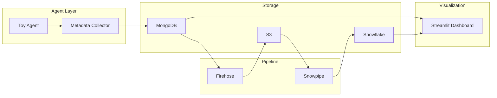

# Pipeline architecture

## Data flow

Metadata in MongoDB (`agent_metadata`) is streamed to Snowflake by the Metadata Streamer: each document is transformed into three records (agent_run, run_step, api_call), which land in **agent_runs**, **run_steps**, and **api_calls** via Firehose → S3 → Snowpipe. This “transform raw to three tables” keeps one source of truth and supports run-level and drill-down analytics without ad-hoc parsing.

## Components (brief)

| Component | File(s) | Role |
|-----------|---------|------|
| Toy Agent | `src/agent/toy_agent.py` | Company research via Tavily (and optional OpenAI summarize). |
| Metadata Collector | `src/agent/metadata_collector.py` | Run/step/call metrics for persistence. |
| MongoDB | `src/database/mongodb_client.py` | Store metadata; source for dashboard and Firehose streamer. |
| Firehose | `src/pipeline/firehose_client.py` | Send records to Kinesis Firehose → S3. |
| Metadata Streamer | `src/pipeline/metadata_streamer.py` | Stream single record or backfill recent from MongoDB to Firehose. |
| Snowpipe | (Snowflake) | Auto-ingest from S3 into Snowflake tables. |
| Dashboard | `src/dashboard/app.py` | Streamlit: health, performance, usage, cost (Snowflake or MongoDB). |

Table schemas and ERD: [data_model_erd.md](data_model_erd.md). Snowpipe DDL: `scripts/snowpipe_setup.sql`.

## Error handling

| Component | Strategy |
|-----------|----------|
| MongoDB | Connection retry; `save_metadata` raises on failure. |
| Firehose | Exponential backoff (3 retries); partial success allowed. |
| Metadata Streamer | Skips if Firehose not configured. |
| run_agent | Logs MongoDB/Firehose failures; agent continues. |
| Dashboard | Shows connection error or empty state. |

## Deployment notes

- **AWS**: Firehose limits and cost; consider IAM roles in production.
- **Snowflake**: Snowpipe uses credits; set alerts.
- **MongoDB Atlas**: M0 limits; optional pause for dev.
