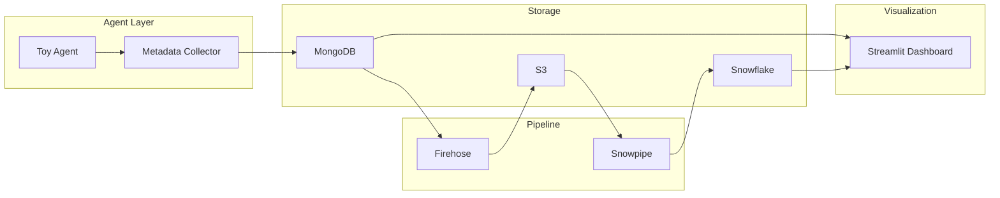

# Tavily Data Pipeline Architecture

## Data Flow



## Component Interactions

### 1. Toy Agent
- **File**: `src/agent/toy_agent.py`
- **Role**: Executes company research via Tavily API
- **Output**: `ResearchState` dict with query, sources, status

### 2. Metadata Collector
- **File**: `src/agent/metadata_collector.py`
- **Role**: Captures execution metrics (event_id, timestamp, query, latency, status, num_sources, etc.)
- **Output**: Metadata dict for persistence

### 3. MongoDB
- **File**: `src/database/mongodb_client.py`
- **Collections**: `agent_metadata` (single-doc) or `agent_runs`, `run_steps`, `api_calls` (3-table)
- **Role**: Primary storage for metadata; source for dashboard and Firehose streaming

### 4. Firehose Client
- **File**: `src/pipeline/firehose_client.py`
- **Role**: Streams metadata records to Kinesis Firehose delivery stream
- **Buffer**: 5MB or 60 seconds per Firehose config

### 5. Metadata Streamer
- **File**: `src/pipeline/metadata_streamer.py`
- **Role**: Polls MongoDB; transforms and sends to Firehose
- **Modes**: One-shot (recent N), or stream single record from run_agent

### 6. Snowpipe
- **Role**: Auto-ingests JSON from S3 into Snowflake (e.g. `agent_runs`, `run_steps`, `api_calls` or legacy `agent_metadata`)
- **Trigger**: S3 event notification

### 7. Streamlit Dashboard
- **File**: `src/dashboard/app.py`
- **Data source**: Snowflake (`agent_runs`, `run_steps`, `api_calls`) with fallback to MongoDB
- **Visualizations**: Agent Health, Agent Performance, Usage & Demand, Cost Efficiency (see README)

## Data Schema

### Target model: three tables (Snowflake and dashboard)

The pipeline is designed around three normalized tables for analytics. See **[Data Model & ERD](data_model_erd.md)** for the full ERD and column descriptions.

- **agent_runs** — One row per run: `run_id`, `company_name`, `industry`, `status`, `started_at`, `completed_at`, `total_latency_ms`, `total_api_calls`, `error_message`, `ingested_at`.
- **run_steps** — One row per step: `step_id`, `run_id` (FK), `step_name`, `status`, `latency_ms`, `error_message`, `ingested_at`.
- **api_calls** — One row per API call: `call_id`, `run_id` (FK), `query_used`, `results_returned`, `latency_ms`, `called_at`, `ingested_at`.

DDL and Snowpipe definitions are in `scripts/snowpipe_setup.sql`.

### Legacy / flat metadata (MongoDB and Firehose today)

The current agent can emit a single flat document for backward compatibility:

```json
{
  "event_id": "uuid",
  "timestamp_utc": "ISO8601",
  "query": "string",
  "query_length": 6,
  "status": "success|failure",
  "latency_ms": 1234.5,
  "response_size_chars": 5000,
  "num_sources": 5,
  "session_id": "uuid",
  "agent_version": "1.0.0",
  "error_message": null
}
```

The dashboard maps this to run-level fields (e.g. `query` → `company_name`, `num_sources` → `total_api_calls`) when Snowflake is not used.

## Error Handling

| Component | Strategy |
|-----------|----------|
| MongoDB | Connection retry; `save_metadata` raises on failure |
| Firehose | Exponential backoff (3 retries); partial success allowed |
| Metadata Streamer | Graceful skip if Firehose not configured |
| run_agent | MongoDB and Firehose failures logged; agent continues |
| Dashboard | Error message on connection failure; empty state |

## Deployment Considerations

- **AWS free tier**: Firehose limits; monitor usage
- **Snowflake credits**: Snowpipe consumes credits; set alerts
- **MongoDB Atlas**: Free M0 limits; consider pause/resume for dev
- **Rate limiting**: Firehose batch size 25 records; avoid burst
