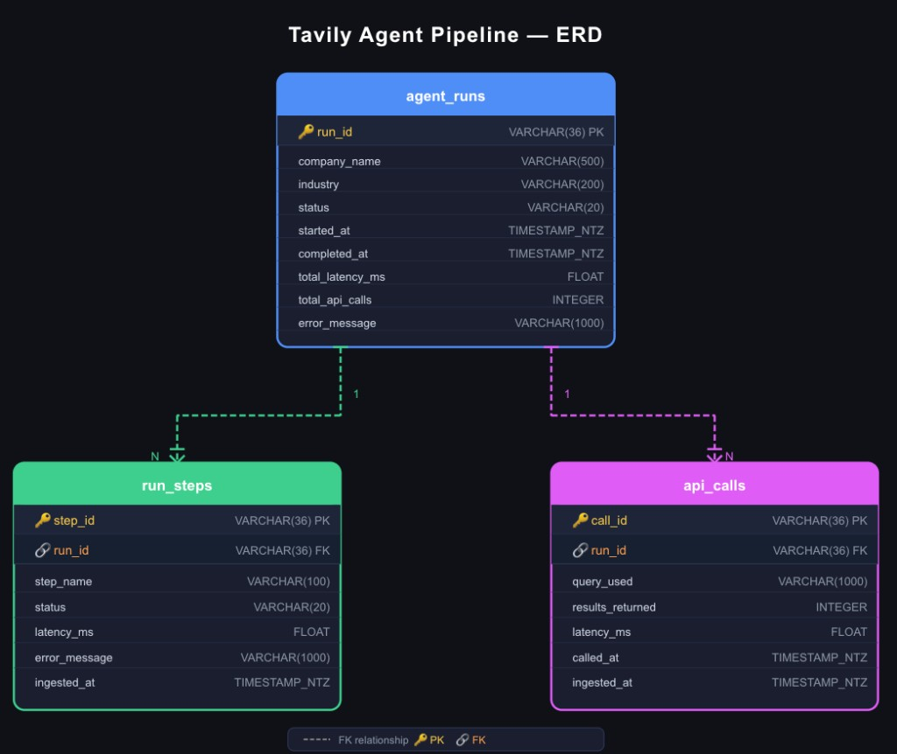
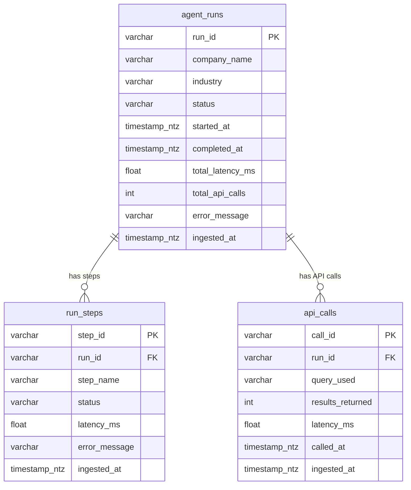

# Data Model & ERD

This document describes the target data architecture for the Tavily agent pipeline: three normalized tables used for analytics and the dashboard, and how they relate.

## Table Architecture

The pipeline is designed to answer **agent health**, **performance**, **usage**, and **cost** questions. To support that, we store:

| Table       | Purpose |
|------------|---------|
| **agent_runs** | One row per company research run: who was queried, outcome, total time, and total API calls. |
| **run_steps**  | One row per step within a run (e.g. `search_overview`, `search_competitors`, `summarize`): status and latency per step. |
| **api_calls**  | One row per external API call (e.g. Tavily): query, result count, latency. |

- **agent_runs** is the main run-level table; **run_steps** and **api_calls** link to it via `run_id`.
- This supports run-level KPIs (success rate, latency, company), step-level debugging (which step failed, slowest step), and call-level analysis (expensive or duplicate queries).

## Entity Relationship Diagram



*ERD: agent_runs (1) → run_steps (N) and agent_runs (1) → api_calls (N).*

Below is the same model in Mermaid for environments that render it:



## Visual ERD (alternative)

Below is the same model in a more visual layout.

```
┌─────────────────────────────────────────────────────────────────────────┐
│                          agent_runs                                      │
├─────────────────────────────────────────────────────────────────────────┤
│ run_id (PK)          │ company_name  │ industry │ status │ started_at   │
│ completed_at         │ total_latency_ms │ total_api_calls │ error_message │
│ ingested_at          │                                               │
└─────────────────────────────────────────────────────────────────────────┘
         │
         │ 1:N
         ├──────────────────────────────────┬──────────────────────────────────┐
         ▼                                  ▼                                  ▼
┌─────────────────────────────┐  ┌─────────────────────────────┐  ┌─────────────────────────────┐
│       run_steps             │  │       api_calls             │  │                             │
├─────────────────────────────┤  ├─────────────────────────────┤  │                             │
│ step_id (PK) │ run_id (FK)  │  │ call_id (PK) │ run_id (FK)  │  │                             │
│ step_name    │ status       │  │ query_used   │ results_ret  │  │                             │
│ latency_ms   │ error_message│  │ latency_ms   │ called_at    │  │                             │
│ ingested_at  │              │  │ ingested_at  │              │  │                             │
└─────────────────────────────┘  └─────────────────────────────┘  └─────────────────────────────┘
```

## Column Summary

### agent_runs
| Column             | Type          | Description |
|--------------------|---------------|-------------|
| run_id             | VARCHAR(36)   | Unique run identifier (e.g. UUID). |
| company_name       | VARCHAR(500)  | Normalized company name from research. |
| industry           | VARCHAR(200)  | Single label (e.g. SaaS, Fintech), from summarize step. |
| status             | VARCHAR(20)   | `success` or `failure`. |
| started_at         | TIMESTAMP_NTZ | Run start time. |
| completed_at       | TIMESTAMP_NTZ | Run end time. |
| total_latency_ms   | FLOAT         | Total run duration in milliseconds. |
| total_api_calls    | INTEGER       | Number of API calls in this run. |
| error_message      | VARCHAR(1000) | Error message if status = failure. |
| ingested_at        | TIMESTAMP_NTZ | When the row was loaded (e.g. by Snowpipe). |

### run_steps
| Column        | Type        | Description |
|---------------|-------------|-------------|
| step_id       | VARCHAR(36) | Unique step identifier. |
| run_id        | VARCHAR(36) | FK to agent_runs.run_id. |
| step_name     | VARCHAR(100)| e.g. `search_overview`, `search_competitors`, `summarize`. |
| status        | VARCHAR(20) | `success`, `failure`, or `skipped`. |
| latency_ms    | FLOAT       | Step duration in ms. |
| error_message | VARCHAR(1000)| Error if step failed. |
| ingested_at   | TIMESTAMP_NTZ| Load timestamp. |

### api_calls
| Column           | Type        | Description |
|------------------|-------------|-------------|
| call_id          | VARCHAR(36) | Unique call identifier. |
| run_id           | VARCHAR(36) | FK to agent_runs.run_id. |
| query_used       | VARCHAR(1000)| The query sent to the API (e.g. Tavily). |
| results_returned | INTEGER     | Number of results returned. |
| latency_ms       | FLOAT       | Call duration in ms. |
| called_at        | TIMESTAMP_NTZ| When the call was made. |
| ingested_at      | TIMESTAMP_NTZ| Load timestamp. |

## How This Serves the Pipeline

- **Streaming**: The agent (or a sync job) can write one JSON record per run to MongoDB and/or to Firehose. Firehose delivers to S3. For the 3-table model, you can either write an envelope (agent_run + run_steps + api_calls) and parse in Snowflake, or write separate objects to S3 prefixes (e.g. `runs/`, `steps/`, `calls/`) and use one Snowpipe per table (see `scripts/snowpipe_setup.sql`).
- **Snowpipe**: Ingests new files from S3 into the three tables; the dashboard and analytics read from these tables.
- **Dashboard**: Uses `agent_runs` for health/performance/usage/cost; uses `run_steps` for step-level charts; uses `api_calls` for top queries and cost efficiency.
