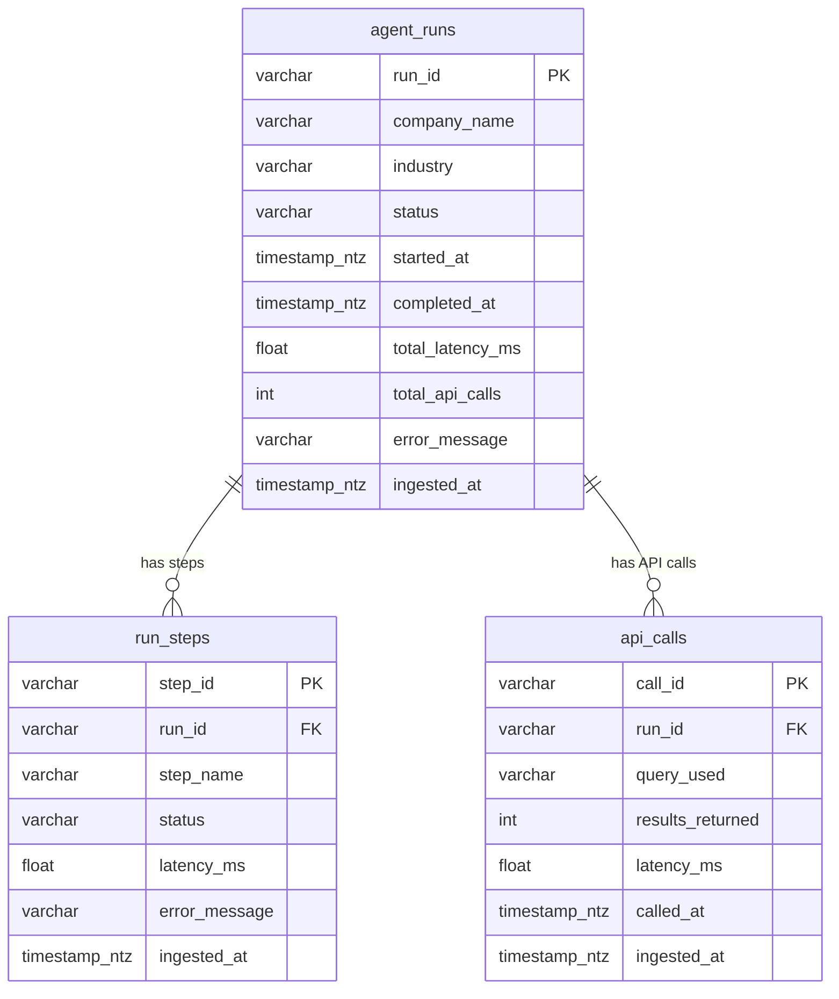

# Data model

Full ERD, column reference, and the transformation from metadata to Snowflake tables. For context on why this shape was chosen see the [README](../README.md#data-model).

---

## ERD



---

## Table purpose

| Table | One-line purpose | Dashboard sections it supports |
|-------|-----------------|-------------------------------|
| **agent_runs** | One row per agent run — the run-level fact table. | Health (success/failure rates), Performance (latency distribution, runs by industry), Usage (runs over time, top companies), Cost (API-call volume). |
| **run_steps** | One row per step within a run (search_overview, search_competitors, summarize). | Health (which steps fail most), Cost (per-step latency). |
| **api_calls** | One row per external API call (Tavily or OpenAI). | Cost (per-query analysis, result counts). |

---

## Column reference

### agent_runs

| Column | Type | Source (from metadata) |
|--------|------|-----------------------|
| run_id | VARCHAR(36) | `event_id` — UUID generated by Metadata Collector. |
| company_name | VARCHAR(500) | `company_name` — normalized by the OpenAI summarize step (falls back to raw query if OpenAI is absent). |
| industry | VARCHAR(200) | `industry` — single label extracted by OpenAI (e.g. "Semiconductors", "SaaS"). `null` if summarize step was skipped. |
| status | VARCHAR(20) | `status` — `"success"` or `"failure"`. |
| started_at | TIMESTAMP_NTZ | `started_at_utc` — when the first step began. |
| completed_at | TIMESTAMP_NTZ | `completed_at_utc` — when the last step finished. |
| total_latency_ms | FLOAT | `latency_ms` — wall-clock duration of the entire run. |
| total_api_calls | INTEGER | Count of entries in the `api_calls` list (typically 2 Tavily + 1 OpenAI = 3). |
| error_message | VARCHAR(1000) | Error string if status is `"failure"`, else `null`. |
| ingested_at | TIMESTAMP_NTZ | Set by Snowflake on load (`DEFAULT CURRENT_TIMESTAMP`). |

### run_steps

| Column | Type | Source |
|--------|------|--------|
| step_id | VARCHAR(36) | UUID generated by Metadata Streamer. |
| run_id | VARCHAR(36) | FK → `agent_runs.run_id`. |
| step_name | VARCHAR(100) | From the agent's step tracking: `"search_overview"`, `"search_competitors"`, or `"summarize"`. |
| status | VARCHAR(20) | `"success"`, `"failure"`, or `"skipped"` (summarize when OpenAI is absent). |
| latency_ms | FLOAT | Wall-clock duration of this individual step. |
| error_message | VARCHAR(1000) | Error string if the step failed. |
| ingested_at | TIMESTAMP_NTZ | Set by Snowflake on load. |

### api_calls

| Column | Type | Source |
|--------|------|--------|
| call_id | VARCHAR(36) | UUID generated by Metadata Streamer. |
| run_id | VARCHAR(36) | FK → `agent_runs.run_id`. |
| query_used | VARCHAR(1000) | The query sent to the API (e.g. `"Nvidia company overview"` for Tavily, `"summarize: Nvidia"` for OpenAI). |
| results_returned | INTEGER | Number of results (Tavily: source count; OpenAI: 1 on success, 0 on failure). |
| latency_ms | FLOAT | Wall-clock duration of this individual API call. |
| called_at | TIMESTAMP_NTZ | UTC timestamp when the call was made. |
| ingested_at | TIMESTAMP_NTZ | Set by Snowflake on load. |

---

## Transformation: metadata → Snowflake records

The **Metadata Streamer** (`src/pipeline/metadata_streamer.py`) expands each metadata document into N records based on the actual agent execution:

```
Metadata document
├─→ 1 agent_run   record  (record_type = "agent_run")
├─→ 3 run_step    records (record_type = "run_step")   ← one per step
└─→ 2–3 api_call  records (record_type = "api_call")   ← one per API call
```

A typical run produces **6–7 Firehose records**: 1 agent_run + 3 run_steps (search_overview, search_competitors, summarize) + 2–3 api_calls (2 Tavily + optionally 1 OpenAI).

Each record carries a `record_type` field used by Firehose dynamic partitioning to route records to the correct S3 prefix (`runs/`, `steps/`, `calls/`), so each Snowpipe reads only its own table's data.

**Backward compatibility:** legacy flat metadata (without `steps`/`api_calls` lists) is handled with a synthetic single step and single API call, so older MongoDB documents can still be streamed.

DDL and Snowpipe definitions: [`scripts/snowpipe_setup.sql`](../scripts/snowpipe_setup.sql).
