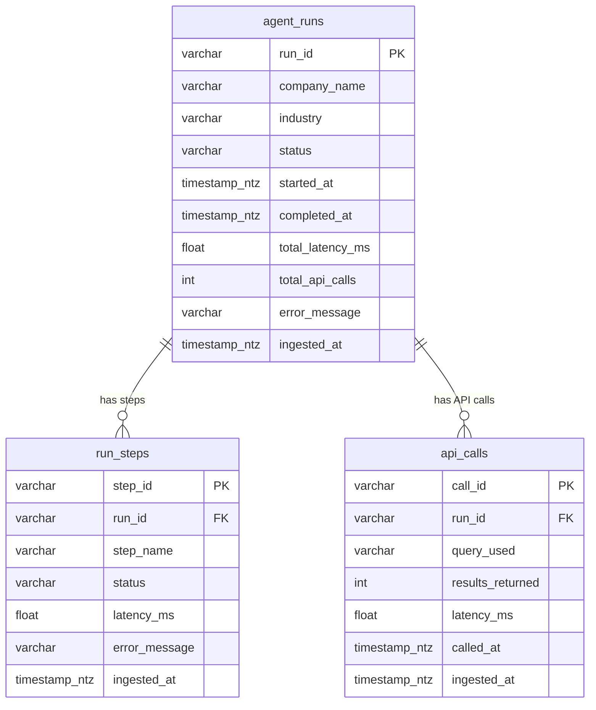

# Data model & ERD

Three normalized tables for analytics and the dashboard. **agent_runs** is the parent; **run_steps** and **api_calls** link via `run_id`.

## ERD

## Table purpose

| Table | Purpose |
|-------|---------|
| **agent_runs** | One row per run: company, industry, status, timings, total API calls. |
| **run_steps** | One row per step (e.g. search_overview, search_competitors, summarize): status, latency. |
| **api_calls** | One row per API call: query, results count, latency. |

## Column reference

### agent_runs
| Column | Type | Description |
|--------|------|-------------|
| run_id | VARCHAR(36) | Unique run id. |
| company_name | VARCHAR(500) | Normalized company from research. |
| industry | VARCHAR(200) | Single label (e.g. SaaS, Fintech). |
| status | VARCHAR(20) | `success` or `failure`. |
| started_at, completed_at | TIMESTAMP_NTZ | Run timing. |
| total_latency_ms | FLOAT | Run duration (ms). |
| total_api_calls | INTEGER | API calls in this run. |
| error_message | VARCHAR(1000) | Error if failed. |
| ingested_at | TIMESTAMP_NTZ | Load time. |

### run_steps
| Column | Type | Description |
|--------|------|-------------|
| step_id | VARCHAR(36) | Unique step id. |
| run_id | VARCHAR(36) | FK to agent_runs. |
| step_name | VARCHAR(100) | e.g. search_overview, summarize. |
| status | VARCHAR(20) | success / failure / skipped. |
| latency_ms | FLOAT | Step duration (ms). |
| error_message | VARCHAR(1000) | Error if failed. |
| ingested_at | TIMESTAMP_NTZ | Load time. |

### api_calls
| Column | Type | Description |
|--------|------|-------------|
| call_id | VARCHAR(36) | Unique call id. |
| run_id | VARCHAR(36) | FK to agent_runs. |
| query_used | VARCHAR(1000) | Query sent to API. |
| results_returned | INTEGER | Result count. |
| latency_ms | FLOAT | Call duration (ms). |
| called_at | TIMESTAMP_NTZ | Call time. |
| ingested_at | TIMESTAMP_NTZ | Load time. |

DDL and Snowpipe: `scripts/snowpipe_setup.sql`.
